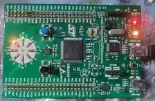

# STM32F3 Discovery

The LED Roulette example on the [STM32F3 Discovery](https://www.st.com/en/evaluation-tools/stm32f3discovery.html) board,
written in Rust. An experiment to get started with embedded development in Rust, as well as testing the IDE based development
and debugging experience in JetBrains CLion while using Rust.

<div align="center">
  
</div>

This project contains a copy of the code from the [stm32f3-discovery](https://github.com/rubberduck203/stm32f3-discovery) crate
as this crate is currently outdated and appears unmaintained.

## Quickstart

Start OpenOCD, e.g. by running [openocd.sh](openocd.sh):

```shell
./openocd.sh
```

In another shell, flash and run the program:

```shell
cargo run --bin stm32f3disco-led-roulette
```

In the GDB prompt, run `continue`.

```gdb
(gdb) continue
```

## Preparing the development environment

- For information on how to set up **Rust, OpenOCD and GDB** for the `thumbv7em-none-eabihf` target,
see [docs/SETUP.md](docs/SETUP.md).
- For a **JetBrains CLion** specific setup, see [docs/CLION.md](docs/CLION.md).
