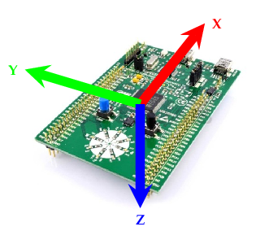

# STM32F3 Discovery

The LED Roulette example on the [STM32F3 Discovery](https://www.st.com/en/evaluation-tools/stm32f3discovery.html) board,
on steroids,
written in Rust. An experiment to get started with embedded development in Rust, as well as testing the IDE based
development
and debugging experience in JetBrains ~~CLion while using Rust~~ RustRover.

<div align="center">
  
</div>

This project covers:

- `probe-rs` flashing and `defmt` logging.
- Driving the user LEDs via a Timer interrupt.
- Querying the LSM303DLHC MEMS IMU via I2C (via [`lsm303dlhc-ng`](https://github.com/sunsided/lsm303dlhc)
  and [`lsm303dlhc-registers`](https://github.com/sunsided/lsm303dlhc-registers)).
    - Observing the magnetometer's `DRDY` with an `EXTI2_TSC` interrupt.
    - Observing the accelerometer's `I1DRDY1` with an `EXTI4` interrupt.
- Operating a USB CDC serial port for communication.

## Sensor orientation

The onboard LSM303DLHC's accelerometer sensor seems to be oriented in a left-handed coordinate system:

- X points forward (towards the USB connectors)
    - When pointing the USB ports downwards, the sensors reads a positive maximum on the
      X axis.
    - When pointing the opposite end downwards, the sensor reads a negative maximum on the X axis.
- Y points left
    - When pointing the left side downwards, the sensor reads a positive maximum on the Y axis.
- Z points down
    - When pointing the bottom side downwards, the sensor reads a positive maximum on the Z axis.

The magnetometer on the other hand - pun not intended - appears to use a right-handed coordinate system :

- X points backward (towards the LEDs)
    - When pointing the USB ports towards the earth's magnetic field vector, the sensors reads a negative maximum on the
      X axis.
    - When pointing the opposite end towards the vector, the sensor reads a positive maximum on the X axis.
- Y points right
    - When pointing the right side towards the vector, the sensor reads a positive maximum on the Y axis.
- Z points up
    - When pointing the top side towards the vector, the sensor reads a positive maximum on the Z axis.

| Accelerometer                    | Magnetometer                    |
|----------------------------------|---------------------------------|
|  |  ||

## Flashing & Running

Easy.

```shell
DEFMT_LOG=info cargo run
````

## Requirements

### Target

This project uses the `thumbv7em-none-eabihf` target. Prepare it using:

```shell
rustup target add thumbv7em-none-eabihf
```

### flip-link

Set up [flip-link](https://github.com/knurling-rs/flip-link):

> Adds zero-cost stack overflow protection to your embedded programs.

### probe-rs

Set up [probe-rs](https://probe.rs/), and follow the setup instructions (e.g.
the [Linux udev rules](https://probe.rs/docs/getting-started/probe-setup/#linux%3A-udev-rules)).

---

## Troubleshooting

### Outdated firmware

My STM32F3 Discovery had an outdated version of the ST-Link firmware, and probe-rs refused to work with it:

> probe-rs failed to open the debug probe
> Error processing command: The firmware on the probe is outdated.

Go
to [ST-LINK, ST-LINK/V2, ST-LINK/V2-1, STLINK-V3 boards firmware upgrade](https://www.st.com/en/development-tools/stsw-link007.html)
and download the latest version. Unzip, run the application and follow the instructions.

```shell
java -jar STLinkUpgrade.jar
```

## Invalid SRAM size definition

> Error: The flashing procedure failed for 'target/thumbv7em-none-eabihf/debug/stm32f3disco-led-roulette'.
>
> Caused by:
> 0: Failed to erase flash sector at address 0x08000000.
> 1: Something during the interaction with the core went wrong
> 2: A timeout occurred.

From [this GitHub comment](https://github.com/probe-rs/probe-rs/issues/2496#issuecomment-2154359915):

> The problem is that the chip has 40KB of main SRAM, but the chip definition says 48KB,
> and we try to place the flash loader's stack at the end of that 48KB region.

I went the hard way and installed `probe-rs` from sources:

```shell
cargo install probe-rs-tools --git https://github.com/probe-rs/probe-rs --locked
```
