# JetBrains CLion Setup

As of writing this (June 4th, 2023), JetBrains CLion does have plug-in support for Rust,
as well as native support for Embedded development, but not for both combined. Once can
however use the [OpenOCD support](https://www.jetbrains.com/help/clion/openocd-support.html)
and custom build tooling to get a reasonable building and debugging experience without
having to resort to a CMake wrapper.

## Set up the target toolchain

Go to **Settings > Build, Execution, Deployment > Toolchains** and create a new
toolchain. In this window, select the GDB for the hardware, in this case
`arm-none-eabi-gdb`. This step may not be strictly required as we will do a similar
selection later on.

<div align="center">
  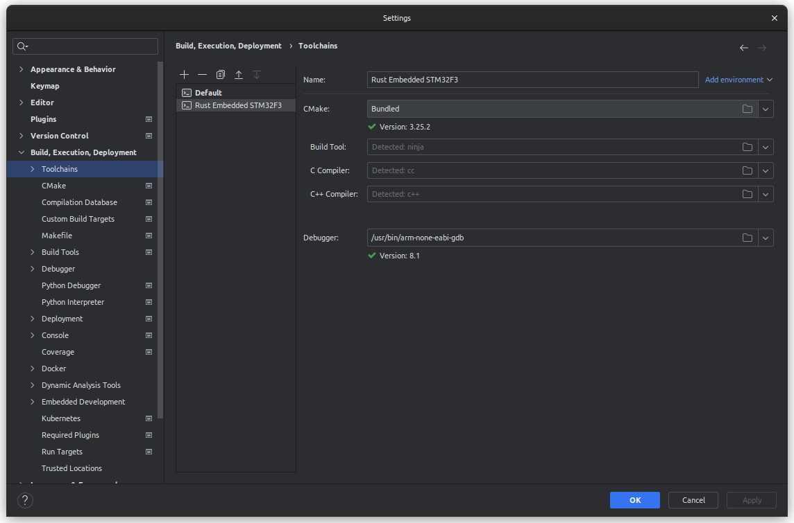
</div>

## Set up the build targets

Go to **Settings > Build, Execution, Deployment > Custom Build Targets** and create a new
target for each binary and flavor to build. In the picture below, I have created
`Cargo Debug` and `Cargo Release` targets and selected the toolchain created above.
The **Build** and **Clean** steps will be created right after.

<div align="center">
  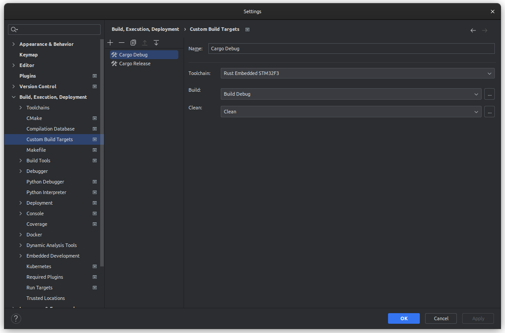
</div>

> This configuration is stored in [`.idea/customTargets.xml`].

Clicking the three-dot button next to **Build** and **Clean** will bring up the
**External Tools** dialog.

<div align="center">
  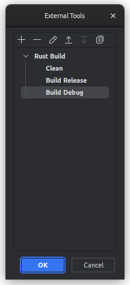
</div>

By clicking the `+` button, create a single target **Clean** and multiple **Build**
targets, one for each flavor or binary you want to build. This will bring up the **Edit Tool**
dialog. The **Group** name can be freely specified in the **Edit Tool** window, I selected
**Rust Build**. You can choose a generic name or a specific name for each binary you build,
e.g. to bundle debug and release builds per binary.

| Clean                                     | Debug Build                                     | Release Build                                       |
|-------------------------------------------|-------------------------------------------------|-----------------------------------------------------|
| 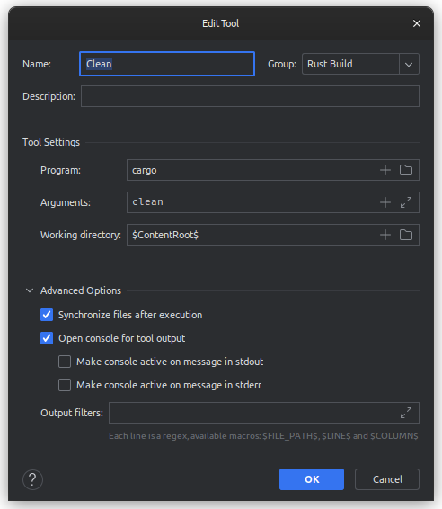 | 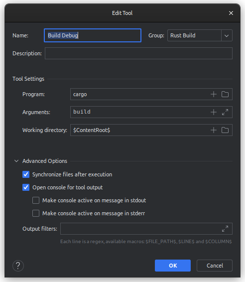 | 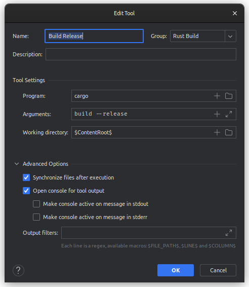 |

> You can omit the `--target ...` argument if your project uses a custom 
> [`.cargo/config.toml`](../.cargo/config.toml) with a `build.target` configuration.
> This project uses:
> 
> ```
> [build]
> target = "thumbv7em-none-eabihf" # Cortex-M4 and Cortex-M7 (no FPU)
> ```

You can use the `+` button next to **Working Directory** to bring up a list of placeholders and
see their current expansion value.

> This configuration is stored in [`.idea/tools/Group.xml`], where `Group` is the name of the group you entered.

[`.idea/customTargets.xml`]: ../.idea/customTargets.xml
[`.idea/tools/Group.xml`]: ../.idea/tools/Rust%20Build.xml

### ⚠️️️ Cargo Workspace Setup

When setting up the project as a [Cargo Workspace](https://doc.rust-lang.org/book/ch14-03-cargo-workspaces.html)
rather than a single binary, the expansions won't be as useful. For example, `$ContentRoot$` refers to
the workspace directory, but so does `$ProjectFileDir$`. To build the right target, you'll have to either
specify `default-members` in the `Cargo.toml` or specifically provide a `--bin your-project` to the build commands.

## Run/Debug Configurations

Lastly we need to set up the run configurations. For this, navigate to **Edit Configurations** in your
Debug/Run Configuration selection. This, unsurprisingly, brings up the **Run/Debug Configurations** dialog.

In here, create a configuration of type **OpenOCD Download & Run**.

- For **Target** select the build target created above. In the example below, I selected **Cargo Debug**.
- For **Executable binary** you select the build binary artifact from the `target` directory. In my case,
  the binary resided at `target/thumbv7em-none-eavbihf` subdirectory `debug` since the project builds for
  the `thumbv7em-none-eavbihf` target.
- Select the **Debugger** by picking the Toolchain you created above, or by pointing to the correct
  debugger on disk if you didn't create a toolchain.
- For **Board config file**, click the **Assist** button. This will bring up the **Select Board Config File** dialog,
  allowing you to select the relevant configuration.
- Leave **GDB port** and **Telnet port** as they are unless they clash with other configuration.
- For **Download** select **Always** or **If updated**.
- For **Reset** select **Halt**. This provided the best debugging experience for me, anyway.
- For **Before launch**, keep **Build**.

<div align="center">
  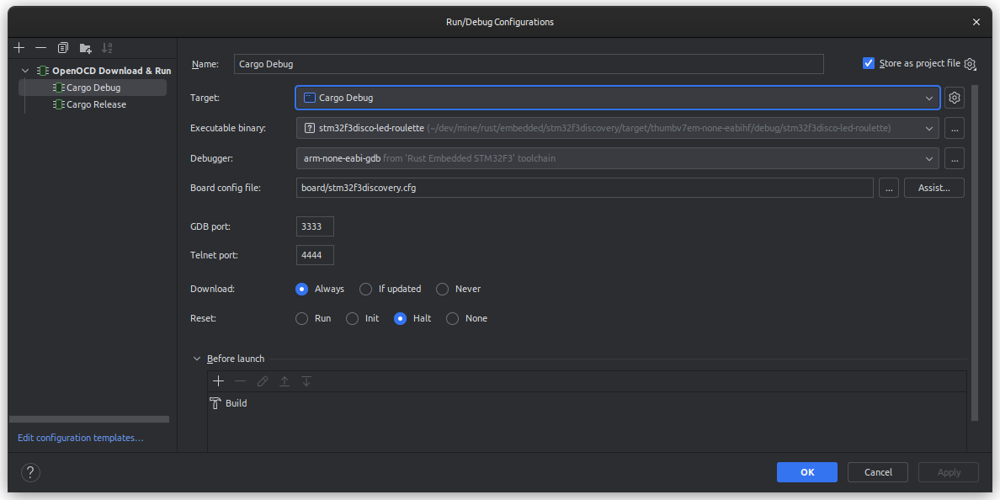
</div>

Select the correct board configuration from the **Select Board Config File** dialog:

<div align="center">
  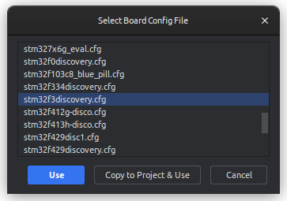
</div>

## Flashing and running the application

When starting the selected Run/Debug Configuration, the **Debug** window should open.
A tooltip will inform you about the firmware being uploaded through OpenOCD and you can
now freely place breakpoints and step through them as usual.

<div align="center">
  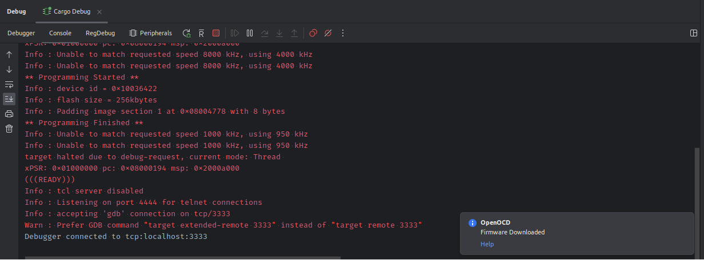
</div>

### System Viewer Description (SVD)

The **Peripherals** tab in the **Debug** view allows you to select the SVD file relevant
to your board. I have selected mine from the [github.com/stm32-rs/stm32-rs](https://github.com/stm32-rs/stm32-rs)
repo's `svd` subdirectory ([here](https://github.com/stm32-rs/stm32-rs/tree/e9edcdcfebb73ac81a972c4a00b755d026fff621/svd/vendor)).

<div align="center">
  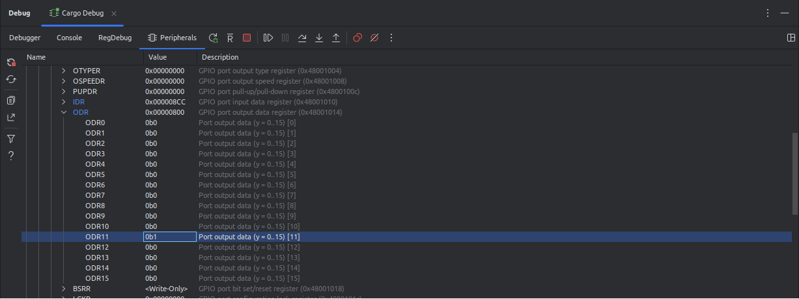
</div>

### Register View

Similarly, the **Registers** tab in the **Debug** view allows you to inspect the current register
values.

<div align="center">
  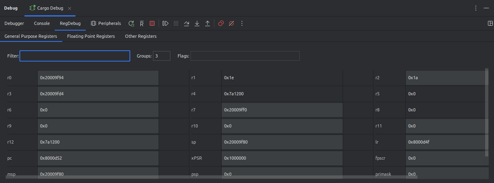
</div>
